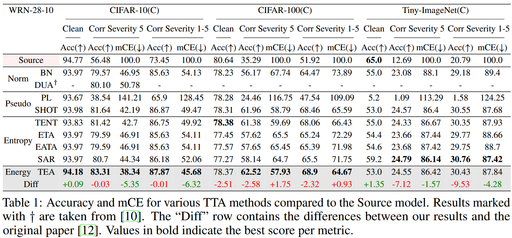
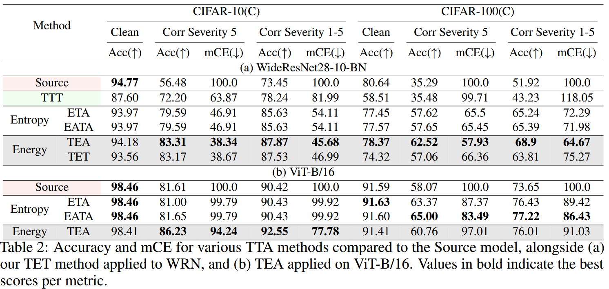

# TEA \& TET: Comparing Test Time Training and Test-Time Adaptation

### 1. Introduction
This repository contains the reproducibility of [(Yuan et al, 2024)](https://arxiv.org/abs/2311.14402) 
Their research introduces test-time energy adaptation (TEA), a test-time adaptation (TTA) approach that utilizes the energy objective as introduced by [(Rathwohl et al, 2019)](https://arxiv.org/abs/1912.03263) to accomodate covariance shifts between the train- and test-distribution. The authors show that incorporating their novel loss objective, with an energy term, achieves state-of-the-art performance on both test-time adaptation, and test-time domain adaptation.\
To expand their findings, we introduce Test Energy Training (TET), which adds a pretraining stage to TEA. Adding this stage allows for inspecting the influence of this pretraining on the effectiveness of TTA. This performance is compared to another TTA methods with a pretraining stage, test-time training (TTT) [(Sun et al, 2020)](http://proceedings.mlr.press/v119/sun20b.html). Specifically these TTA methods which included a pretraining stage were left out of their baselines.\
Furthermore, we generalize the results of TEA to a more state-of-the-art architect, Vision Transformers [(Dosovitskiy et al, 2020)](https://arxiv.org/pdf/2010.11929/1000), as the authors only evaluate their model on the legacy ResNet architecture.


### 2. Results

#### 2.1 Replication
Below, in Table 1, results for the replication of the original research [(Yuan et al, 2024)](https://arxiv.org/abs/2311.14402) are shown. We achieve similar results as their research, only diverging on the Tiny-ImageNet dataset.
<div style="text-align: center;">
  
</div>

These specific results can be replicated using the `Replication of TEA` section in `replicate.ipynb`.

#### 2.2 Extension
Below in Table 2, results for TET, TTT, and the ViT results are shown.\
Our TET model achieves slightly lower accuracy than TEA on the corruption set of CIFAR-10, and significantly lower accuracy on the corruption set of CIFAR-100. TTT achieves significantly worse performance than all other TTA methods. These two findings suggest that TTA approaches requiring source training may underperform compared to purely test-time adaptation methods.
<div style="text-align: center;">
  
</div>


## Contributions
<table>
  <tr>
    <th>Name</th>
    <th>Work</th>
  </tr>
  <tr>
    <td rowspan="2">Brandon</td>
    <td>Coordinating the team</td>
  </tr>
  <tr>
    <td>Replicating TTT results</td>
  </tr>
  <tr>
    <td rowspan="3">Jan</td>
    <td>Replicating original results, as found in Table 1</td>
  </tr>
  <tr>
    <td>Adding the Vision Transformer architecture and results </td>
  </tr>
  <tr>
    <td>Helping run the TET results, and discussing possible solutions to unstable energy training </td>
  </tr>
  </tr>
  <tr>
    <td rowspan="2">Henk</td>
    <td> Looking into replication of figures </td>
  </tr>
  <tr>
    <td> Helping create code for TET </td>
  </tr>
  <tr>
    <td rowspan="2">Julian</td>
    <td>Helping with TET code, exploring getting TET to work</td>
  </tr>
  <tr>
    <td>Finalizing report structure & flow
    </td>
  </tr>
</table>

### References
```
@article{dosovitskiy2020image,
  title={An image is worth 16x16 words: Transformers for image recognition at scale},
  author={Dosovitskiy, Alexey and Beyer, Lucas and Kolesnikov, Alexander and Weissenborn, Dirk and Zhai, Xiaohua and Unterthiner, Thomas and Dehghani, Mostafa and Minderer, Matthias and Heigold, Georg and Gelly, Sylvain and others},
  journal={arXiv preprint arXiv:2010.11929},
  year={2020}
}
```
```
@article{grathwohl2019your,
  title={Your classifier is secretly an energy based model and you should treat it like one},
  author={Grathwohl, Will and Wang, Kuan-Chieh and Jacobsen, J{\"o}rn-Henrik and Duvenaud, David and Norouzi, Mohammad and Swersky, Kevin},
  journal={arXiv preprint arXiv:1912.03263},
  year={2019}
}
```
```
@inproceedings{sun2020ttt,
  title={Test-time training with self-supervision for generalization under distribution shifts},
  author={Sun, Yu and Wang, Xiaolong and Liu, Zhuang and Miller, John and Efros, Alexei and Hardt, Moritz},
  booktitle={International conference on machine learning},
  pages={9229--9248},
  year={2020},
  organization={PMLR}
}

```
```
@misc{yuan2024teatesttimeenergyadaptation,
      title={TEA: Test-time Energy Adaptation}, 
      author={Yige Yuan and Bingbing Xu and Liang Hou and Fei Sun and Huawei Shen and Xueqi Cheng},
      year={2024},
      eprint={2311.14402},
      archivePrefix={arXiv},
      primaryClass={cs.LG},
      url={https://arxiv.org/abs/2311.14402}, 
}
```
